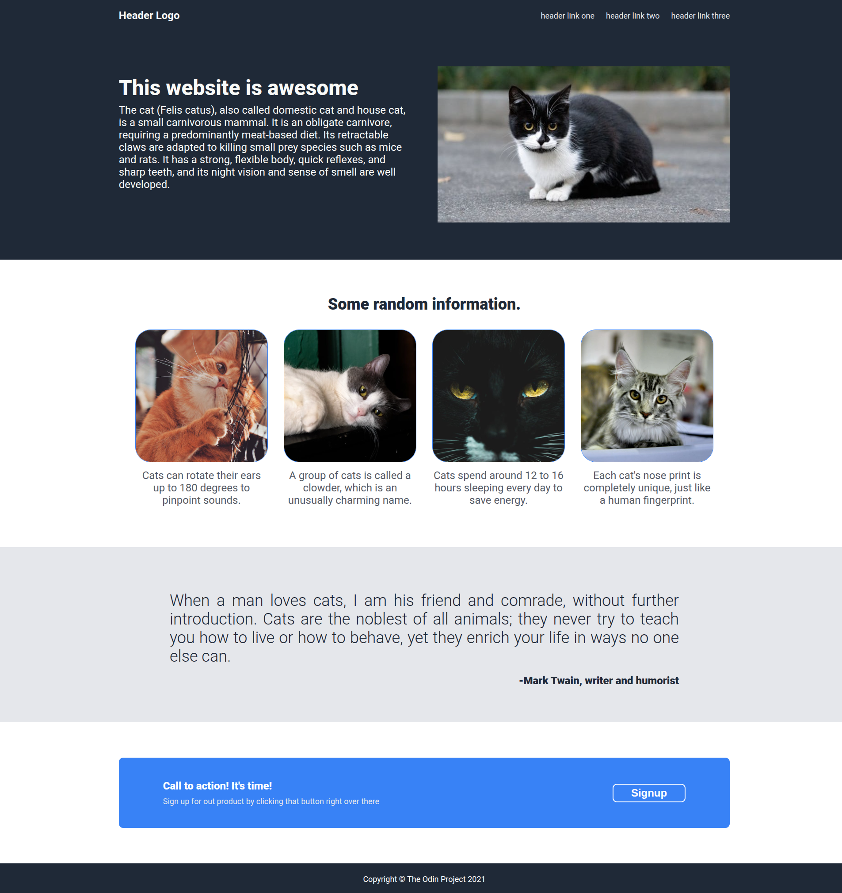

# Landing Page Flexbox

This project is a landing page built as part of **The Odin Project - Foundations** curriculum.

---
## Project Goal
The goal of this project is to practice and demonstrate:
- Using **CSS Flexbox** for layout
- Structuring a webpage with semantic **HTML**
- Building a clean and visually appealing landing page from a design specification

## Built With
- HTML5
- CSS3 (Flexbox)

## Preview

## Objectives
- How to use Flexbox to align and distribute elements
- Building layouts without relying on frameworks
- Translating a design reference into a real webpage

---
## Live Demo
View the project live on [GitHub Pages](https://abdallahkhat.github.io/landing-page-flexbox/).

---
## Credit

This project was built following the guidance from [Landing Page - The Odin Project](https://www.theodinproject.com/lessons/foundations-landing-page).

Cat images used in this project were sourced from [Pexels](https://www.pexels.com) and are free to use.

  - Photos by [Peter Xie](https://www.pexels.com/photo/black-and-white-cat-in-outdoor-setting-34574274/), [Alexas Fotos](https://www.pexels.com/photo/orange-cat-on-focus-photography-2173872/), [Alexandros Chatzidimos](https://www.pexels.com/photo/photo-of-cat-s-face-3652805/), [Craig Adderley](https://www.pexels.com/photo/close-up-photo-of-black-cat-1715092/), [Сергей Сёмин](https://www.pexels.com/photo/maine-coon-in-close-up-photography-6133175/)
